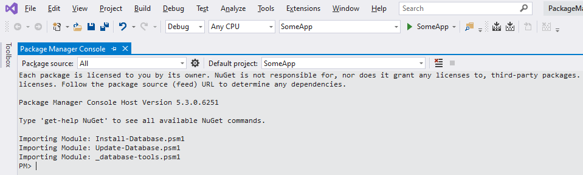

How to use SqlDatabase in the VS Package manager console
=======================================================

This example shows how to combine [SolutionScripts](https://www.nuget.org/packages/SolutionScripts/) and SqlDatabase

Open [PackageManagerConsole](PackageManagerConsole.slnx) solution in the Visual Studio. Open Package manage console (in the VS menu Tools/NuGet Package Manager/Package Manager Console)

As you can see there are 2 cmd-lets are available:
- Install-Database: create database based on scripts from [CreateDatabaseFolder](../CreateDatabaseFolder) example
- Update-Database: upgrade database based on scripts from [MigrationStepsFolder](../MigrationStepsFolder/StraightForward) example

Cmd-lets are loaded into the powershell session by NuGet package SolutionScripts, details are [here](https://github.com/mhinze/solutionscripts).

Both cmd-lets take connection string from SomeApp/App.config file and invoke SqlDatabase.

> Important: after the first initialization any changes in the SolutionScripts are not visible to the package manager console. Invoke *Update-SolutionScripts* command in the  console to apply changes.